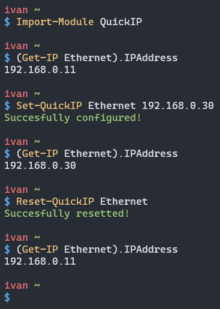

# QuickIP-PS



Tiny Powershell module for quick IP setting/resetting.

## Installing

```powershell
Install-Module QuickIP
```

## Usage

> Don't forget to import module =)
>
> ```powershell
> Import-Module QuickIP
> ```

### `Set-QuickIP`

```
NAME
    Set-QuickIP

SYNOPSIS
    Sets a static IP address for interface.


SYNTAX
    Set-QuickIP [-Interface] <String> [-IPAddress] <IPAddress> [<CommonParameters>]


DESCRIPTION


PARAMETERS
    -Interface <String>
        Net interface name.
        Get it by `Get-NetIPAddress -AddressFamily IPv4 | Select-Object -Property InterfaceAlias,IPAddress`.

        Required?                    true
        Position?                    1
        Default value
        Accept pipeline input?       false
        Accept wildcard characters?  false

    -IPAddress <IPAddress>
        IP address.

        Required?                    true
        Position?                    2
        Default value
        Accept pipeline input?       false
        Accept wildcard characters?  false

    <CommonParameters>
        This cmdlet supports the common parameters: Verbose, Debug,
        ErrorAction, ErrorVariable, WarningAction, WarningVariable,
        OutBuffer, PipelineVariable, and OutVariable. For more information, see
        about_CommonParameters (https://go.microsoft.com/fwlink/?LinkID=113216).

INPUTS

OUTPUTS

    -------------------------- EXAMPLE 1 --------------------------

    PS > Set-QuickIP -i "Ethernet" -ip 192.168.0.32


RELATED LINKS

```

### `Reset-QuickIP`

```
NAME
    Reset-QuickIP

SYNOPSIS
    Resets IP of interface to DHCP.


SYNTAX
    Reset-QuickIP [-Interface] <String> [<CommonParameters>]


DESCRIPTION


PARAMETERS
    -Interface <String>
        Net interface name.
        Get it by `Get-NetIPAddress -AddressFamily IPv4 | Select-Object -Property InterfaceAlias,IPAddress`.

        Required?                    true
        Position?                    1
        Default value
        Accept pipeline input?       false
        Accept wildcard characters?  false

    <CommonParameters>
        This cmdlet supports the common parameters: Verbose, Debug,
        ErrorAction, ErrorVariable, WarningAction, WarningVariable,
        OutBuffer, PipelineVariable, and OutVariable. For more information, see
        about_CommonParameters (https://go.microsoft.com/fwlink/?LinkID=113216).

INPUTS

OUTPUTS

    -------------------------- EXAMPLE 1 --------------------------

    PS > Reset-QuickIP -i "Ethernet"


RELATED LINKS

```
